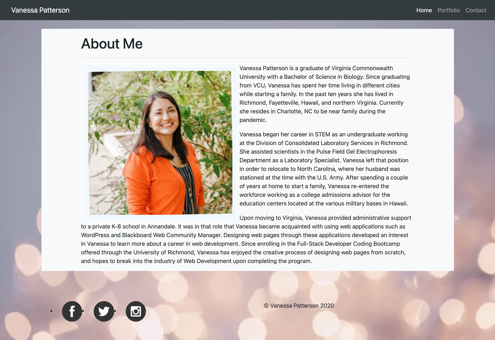
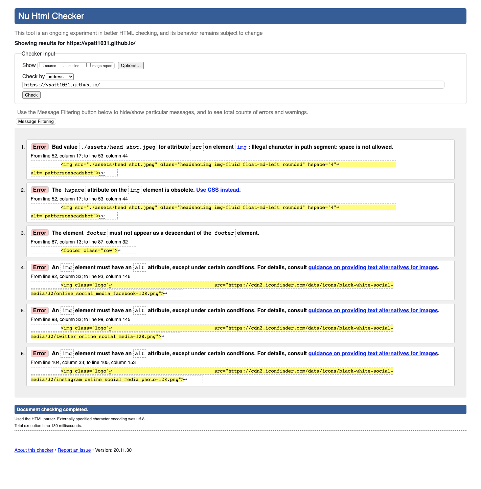
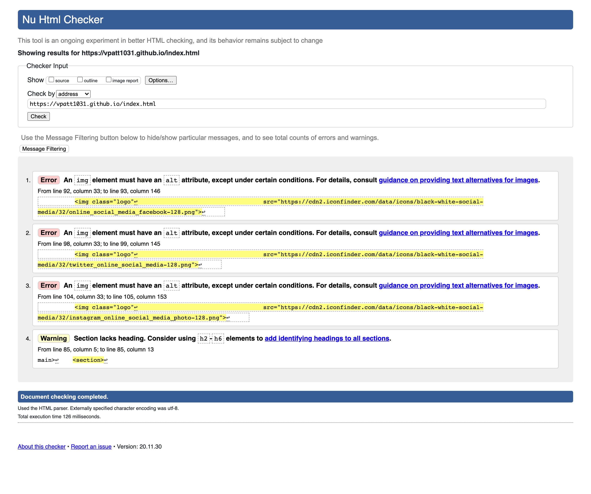
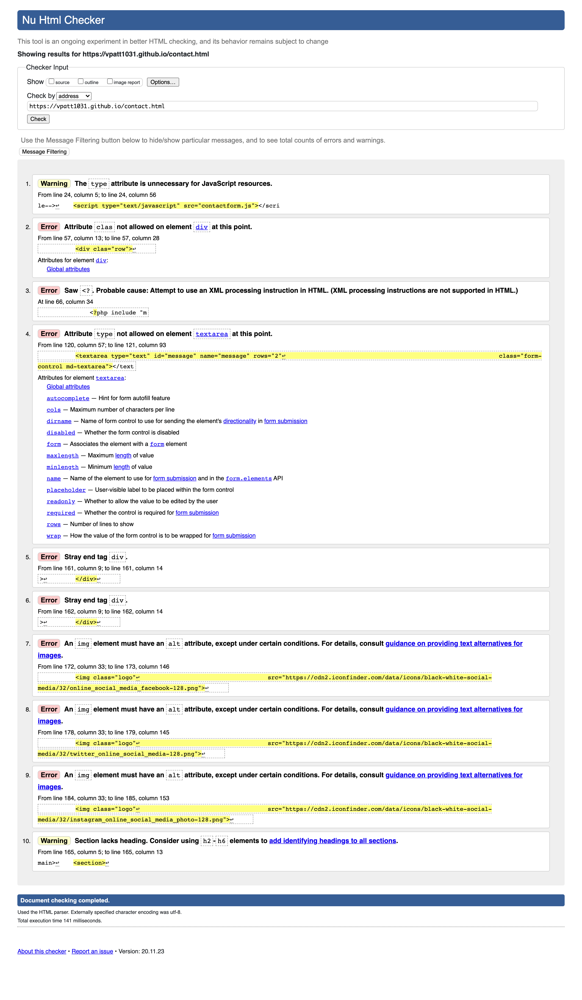

# vpatt1031.github.io
# Description
This project is a responsive portfolio of the applications I've produced thus far. It will be home to all my future projects and encompass my progress as a web developer. The responsiveness of this portfolio refers to the application's ability to render aesthitically pleasing webpages across a variety of different devices and their screen sizes. To achieve this endeavor, I utilized Bootstrap's library and grid system. While a responsive portfolio was the main goal of this project, it was also important to maintain semantically coded html, and ensure that the style.css sheet did not contain repetitive code. The html from each page of this portfolio was checked using validator.w3.org for errors. Screen shots were taken of the results for each page and added to the assets folder. Efforts were made to correct as many mistakes as possible. I also spent a significant amount of time trying to add functionality to the contact.html page. This was an endeavor I still do not have the requisite knowledge to further just yet. I left the files I added to enable the contact.html page so that I can come back to it at a later time.

# Link to Project
https://vpatt1031.github.io/

# Screen Shot of Project
screenshot-vpatt1031-github-io-index-html-1606797208056

# Screen Shots of HTML Validator

